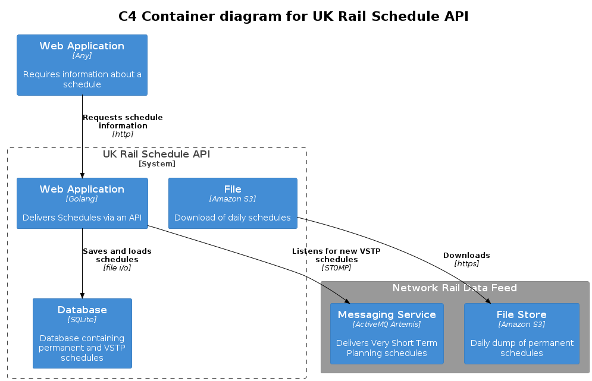
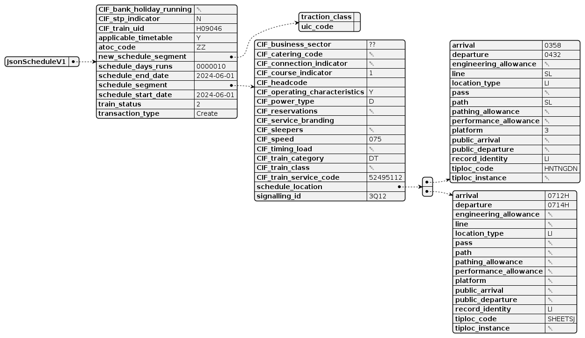
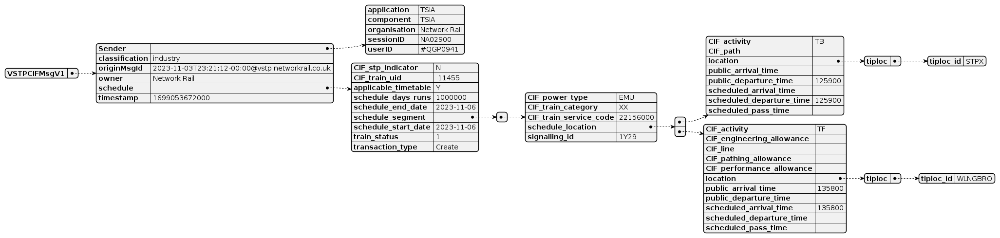
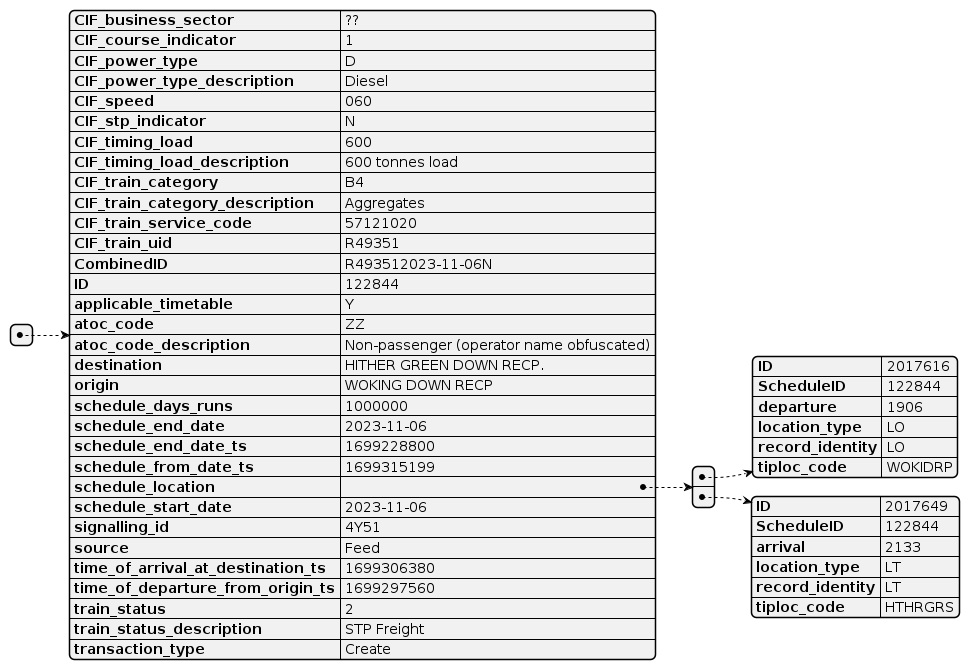

# UK Rail Schedule API

The UK Rail Schedule API is a service that provides access to detailed UK train schedules from Network Rail's Integrated Train Planning System (ITPS).

The service
- Loads data from a SCHEDULE feed file in json format
- Loads Very Short Term Planning (VSTP) updates from Network Rail's STOMP messaging service
- Responds to http requests from clients for information on train schedules 

If you want
- to be able find information on train schedules (both permanent and VSTP) based on headcode (aka signalling id), train uid and filtered by date, location or operating company, or
- a database of train schedules 

Then this service could be for you.

## Setup

### What you will need

- Credentials to access the Network Rail data feeds. If you don't already have one, you can apply for one here: https://publicdatafeeds.networkrail.co.uk/ntrod/welcome

- The latest release of uk-rail-schedule-api from the [releases page](https://github.com/andrewl/uk-rail-schedule-api/releases/latest)

### Configuring

- Copy config.yaml.example to config.yaml and update with your Network Rail data feed username and password
- All of the other options have usable defaults, you can override them if necessary in your config.yaml 

### Running

You'll need to download a copy of the Network Rail Schedule Feed and save it as schedule.json. The file is available, gzipped at the following url (you'll need to be logged in with your network rail account to access it): https://publicdatafeeds.networkrail.co.uk/ntrod/CifFileAuthenticate?type=CIF_ALL_FULL_DAILY&day=toc-full

Once you've downloaded your initial schedule file, you'll just need to uncompress it with gzip and ensure the file is called schedule.json (or whatever you might have changed it to in your config.yaml)

Run the service

    ./uk-rail-schedule-api

This will load the schedules into the database from the schedule.json and listen for updates from the VSTP STOMP service. The loading of the schedules can take some time (up to 30 minutes), but during this time the service will still respond to http requests - albeit just on the data that has been loaded up until that time.

As soon as the service is started the the service will log message to the location specified in config.yaml (by default stderr)

## Container diagram

 

## API Reference

### Schedules endpoint

/schedules/{identifierType}/{identifier} - returns a JSON array of schedules running today matching the given identifier. The identifier can either be
- A headcode (also known as a signalling id) 
- A train uid (also known as a CIF train uid)

You can further filter on location, date or train operating code by adding one or more of the following query string parameters
- location - If specified, only return schedules that will pass through the location with a matching [TIPLOC](https://wiki.openraildata.com/index.php/Identifying_Locations
)
- date - A date, in the form YYYY-MM-DD, that the schedule will run on. If this is not specified then the API will only return schedules for today's date

- atoc - If specified, only return schedules that match the train operating company's [cod](https://wiki.openraildata.com/index.php?title=TOC_Codes) (this can be useful as headcodes are not globally unique - they can be used by multiple operators on the same day, referring to different trains)

The /schedules endpoint will return an array of schedules. Any applicable overlays that have been received from the VSTP service will be applied to any schedules returned.

The structure is similar to that described [here](https://wiki.openraildata.com/index.php?title=Schedule_Records) with the following differences

1. the schedule_segment and new_schedule_segments are flattened into the main schedule structure
2. the service adds a number of additional fields for convenience as follows

- Source - Either "Feed" for the schedule file, "Feed,VSTP" for a schedule in the feed file that's been subsequently overlayed by a VSTP schedule, or "VSTP" for a schedule that was created during the VSTP.
- CIFTrainCategoryDescription - A description of the train category from https://wiki.openraildata.com/index.php?title=CIF_Codes
- CIFOperatingCharacteristicsDescription - A comma separated list of operating characteristics from https://wiki.openraildata.com/index.php?title=CIF_Codes
- CIFPowerTypeDescription - A description of the power type of the train from https://wiki.openraildata.com/index.php?title=CIF_Codes
- TrainStatusDescription - A description of the train's status from https://wiki.openraildata.com/index.php?title=CIF_Codes
- CIFTimingLoadDescription - A description of the train's timing load from https://wiki.openraildata.com/index.php?title=CIF_Codes
- AtocCodeDescription - The name of the Train Operating Company
- TimeOfDepartureFromOriginTS - Unix timestamp indicating the train's departure time at it's origin
- TimeOfArrivalAtDestinationTS - Unix timestamp indicating the train's arrival time at it's destination
- Origin - Description of the origin station
- Destination - Description of the destination station

### Status endpoint
 
/status - returns the status (currently just the number of schedules provided by each of the two sources - the json feed and vstp service)

### Refresh endpoint

/refresh - refreshes the database from the schedule json.

### Examples

    http://127.0.0.3333/schedules/headcode/AB91

Returns the schedules running today with the headcode AB91

    http://127.0.0.3333/schedules/trainuid/AB91?location=IPSWICH

Returns the schedules running today with the train uid of ZX12345 that passes through Ipswich

## Schedule format

The physical format of a Schedule varies between the Schedule JSON and the VSTP messages. Whilst they share many common fieldnames the structure is different.

### Schedule feed structure

 

### VSTP feed structure

 

### Schedule returned by API

The UK Rail Schedule API delivers schedule information in a simplified form, but maintains all of the existing fields

 

## Additional Information

- There is a wealth of information about feeds, schedules and other UK railway information over at the [Open Rail Data Wikiurl](https://wiki.openraildata.com/index.php)
- The API uses a SQLite database as the data source for improved performance and reliability.
- It's important to regularly update the schedule data by re-running the Data Loader mode with the latest Network Rail schedule JSON file. The
- The API provides detailed information about train schedules to assist developers and applications in accessing and utilizing this data efficiently.

**Note:** This API is intended for informational and development purposes only and is not affiliated with or endorsed by Network Rail. Network Rail's data usage terms and conditions apply.

## Building from Source

@todo
